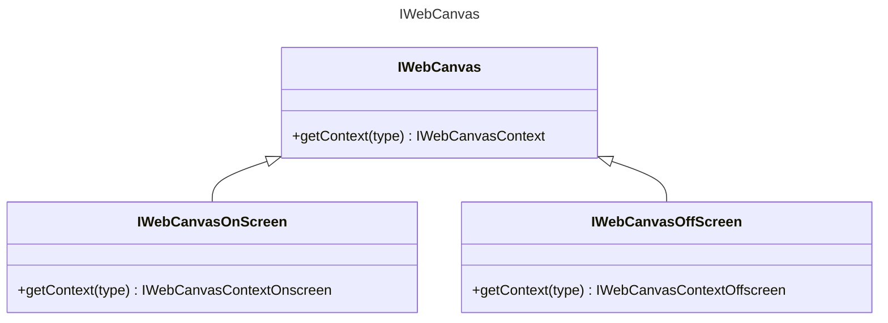
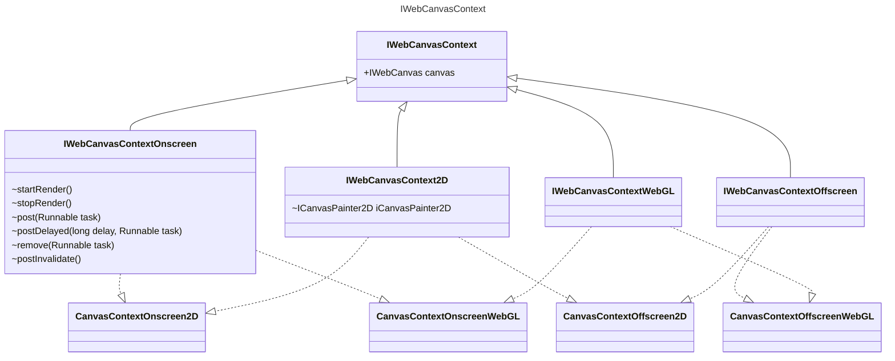

```mermaid
---
title: IWebCanvas
---
classDiagram
    class IWebCanvas
    IWebCanvas : +getContext(type) IWebCanvasContext
    
    IWebCanvas <|-- IWebCanvasOnScreen
    IWebCanvasOnScreen : +getContext(type) IWebCanvasContextOnscreen

    IWebCanvas <|-- IWebCanvasOffScreen
    IWebCanvasOffScreen : +getContext(type) IWebCanvasContextOffscreen
```

```mermaid
---
title: IWebCanvasContext
---
classDiagram
    class IWebCanvasContext {
        +IWebCanvas canvas
    }
    class IWebCanvasContextOnscreen {
        ~startRender()
        ~stopRender()
        ~post(Runnable task)
        ~postDelayed(long delay, Runnable task)
        ~remove(Runnable task)
        ~postInvalidate()
    }
    class IWebCanvasContext2D {
        ~ICanvasPainter2D iCanvasPainter2D
    }

    IWebCanvasContext  <|-- IWebCanvasContextOnscreen
    IWebCanvasContext <|-- IWebCanvasContextOffscreen 
    IWebCanvasContext <|-- IWebCanvasContext2D 
    IWebCanvasContext <|--  IWebCanvasContextWebGL 

    IWebCanvasContextOnscreen ..|> CanvasContextOnscreen2D
    IWebCanvasContext2D ..|> CanvasContextOnscreen2D

    IWebCanvasContextOnscreen ..|> CanvasContextOnscreenWebGL
    IWebCanvasContextWebGL ..|> CanvasContextOnscreenWebGL

    IWebCanvasContext2D ..|> CanvasContextOffscreen2D
    IWebCanvasContextOffscreen ..|> CanvasContextOffscreen2D
    

    IWebCanvasContextOffscreen ..|> CanvasContextOffscreenWebGL
    IWebCanvasContextWebGL ..|> CanvasContextOffscreenWebGL
```